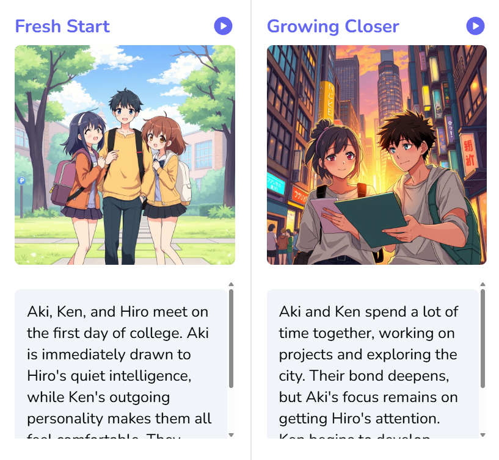

# TaleCrafter AI

  

---

## Overview

**TaleCrafter AI** is an innovative, full-stack web application that leverages artificial intelligence to generate personalized, interactive storybooks. Users can create professionally illustrated and narrated stories by simply specifying their preferences. The platform combines advanced AI capabilities with an engaging user interface, providing a seamless experience for creating, reading, and sharing unique stories.

Whether you're an author exploring new ideas, a parent seeking engaging content for children, or someone looking to bring imagination to life, TaleCrafter AI transforms creative prompts into complete, illustrated storybooks with professional narration.

---

## 🚀 Live Demo

Experience TaleCrafter AI in action:

- **Primary**: [https://www.talecrafterai.tech/](https://www.talecrafterai.tech/)
- **Backup**: [https://talecrafter-ai.vercel.app](https://talecrafter-ai.vercel.app/)

  

---

## ✨ Key Features

### 📖 AI-Powered Story Generation
- **Intelligent Storytelling**: Creates complete, coherent narratives based on user input using advanced AI models
- **Customizable Parameters**: Choose story subject, target age group, genre, and artistic style
- **Image-to-Story**: Generate stories directly from uploaded images for enhanced creativity

### 🎨 Interactive Experience
- **Animated Book Interface**: Immersive page-flip animation for authentic reading experience
- **Dual Reading Modes**: Switch between Flipbook mode and Story mode for different reading flows
- **Multiple Art Styles**: Professional illustration styles including Oil Painting, Watercolor, Comic, Anime, 3D, and more
- **Age-Appropriate Content**: Tailored stories for Toddlers, Kids, Pre-teens, Teens, and Adults

### 🔊 Accessibility Features
- **Text-to-Speech (TTS)**: Full audio narration of generated stories for immersive listening
- **Smart Narration Control**: Starting narration on a new chapter automatically stops previous playback
- **Responsive Design**: Optimized for mobile, tablet, and desktop experiences

### 📄 Export & Sharing
- **Image-First PDF Export**: Download chapter-formatted PDFs with generated visuals and text
- **Story-Mode Download Flow**: PDF export appears in Story mode for focused reading/export UX
- **Quick Story Sharing**: Share story links using native share or copy-to-clipboard

### 💰 Flexible Monetization
- **Credit-Based System**: Pay-as-you-go model for story generation
- **Secure Payments**: Integrated PayPal for reliable transactions
- **Transparent Pricing**: Clear credit allocation based on features used

### 👤 User Management
- **Secure Authentication**: Enterprise-grade authentication via Clerk
- **User Dashboard**: Track created stories, usage history, and credits
- **Story Library**: Organize and access all generated stories in one place

### 🎯 Discovery & Inspiration
- **AI-Powered Recommendations**: Smart suggestions for story ideas
- **Explore Section**: Browse stories from the community
- **Admin Dashboard**: Content management and platform oversight

---

## 🛠️ Technology Stack

### Frontend & Framework
- **Next.js 16** - Modern React framework with server-side rendering and API routes
- **React 18** - UI component library
- **TypeScript** - Type-safe JavaScript for robust development
- **Tailwind CSS** - Utility-first styling framework
- **NextUI** - Premium React component library for polished UI

### Animation & Interactions
- **Framer Motion** - Advanced animations and transitions
- **React PageFlip** - Book page-flip animation library

### AI & Language Models
- **Google Generative AI (Gemini)** - Core AI engine for story generation
- **Gemini Vision** - Image understanding and analysis

### Backend & Database
- **PostgreSQL** - Reliable relational database
- **Neon** - Serverless PostgreSQL platform
- **Drizzle ORM** - Type-safe database operations
- **Next.js API Routes** - Serverless backend functions

### Authentication & Payments
- **Clerk** - Modern authentication and user management
- **PayPal** - Secure payment processing

### Utilities
- **Axios** - HTTP client for API requests
- **React Toastify** - User notifications
- **React Icons** - Comprehensive icon library
- **jsPDF + html2canvas** - PDF generation for story exports

---

## 🎯 Usage Guide

### Creating Your First Story

1. **Sign Up / Log In**
   - Navigate to the application and create an account or log in with your credentials
   - Your account is secured through Clerk authentication

2. **Access Story Creation**
   - Click "Create Story" from the navigation menu
   - Land on the story creation interface

3. **Specify Story Details**
   - **Subject**: Enter the main topic or character for your story
   - **Age Category**: Select target audience (Toddler, Kids, Pre-teens, Teens, Adult)
   - **Genre**: Choose from Fantasy, Science Fiction, Romance, Horror, History, Mythology, Crime Thriller, Educational, and Motivational
   - **Art Style**: Pick your preferred visual style (Oil Painting, Watercolor, Comic, Anime, 3D, Sketch, Charcoal Drawing, Paper Cut)

4. **Generate Story**
   - Click "Generate" and let the AI create your unique story
   - AI will process your preferences and generate a complete narrative

5. **Experience Your Story**
   - Read in animated **Flipbook** mode for page-turn interactions
   - Toggle to **Story** mode for chapter cards and export-ready layout
   - Use narration controls with automatic stop when another chapter starts

6. **Manage Your Stories**
   - Access your story library from the dashboard
   - Share stories with others using built-in sharing features
   - Download stories as image-rich PDF files for offline reading

### Credit System

- **Free Trial**: New users receive starter credits to explore the platform
- **Purchase Credits**: Buy additional credits through PayPal integration
- **Credit Allocation**: Each story generation uses a specific number of credits based on story length and complexity

### Admin Features

- Access the admin dashboard for content moderation
- Monitor platform usage and user activity
- Manage featured stories and recommendations

---

## 📚 Database Schema

The application uses PostgreSQL with the following main entities:

- **Users**: User accounts and authentication data
- **Stories**: Generated stories with metadata
- **Chapters**: Story chapters and content
- **Credits**: User credit balances and transactions
- **Feedback**: User feedback and ratings

Database migrations are managed through Drizzle ORM.

---

## 🔐 Security & Privacy

- **Secure Authentication**: Industry-standard JWT tokens via Clerk
- **Password Security**: Encrypted password storage and transmission
- **Data Protection**: HTTPS encryption for all data in transit
- **Privacy Compliance**: GDPR-compliant user data handling

---

## 🙋 Support & Feedback

- **Report Issues**: Use the GitHub issues tracker
- **Feature Requests**: Suggest new features via issues
- **Questions**: Create a discussion thread

---

## 🎉 Acknowledgments

- **Google Generative AI** for powerful language models
- **Clerk** for seamless authentication
- **Vercel** for excellent hosting and deployment
- **Open Source Community** for inspiring libraries and tools

---

  
**Made with ❤️ by the Aditya Shriwas**

[Visit Website](https://www.talecrafterai.tech/) • [Report Bug](https://github.com/adityashriwas/TaleCrafter-AI/issues) • [Request Feature](https://github.com/adityashriwas/TaleCrafter-AI/issues)

